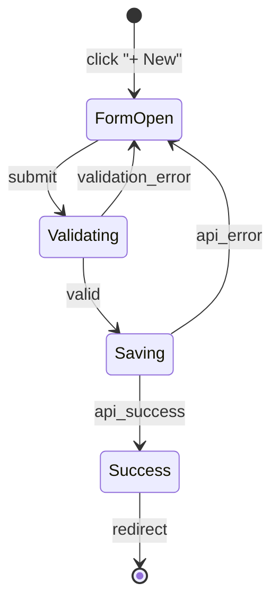

# Modes of Thought - Universal Analysis Frameworks

> **2030 Philosophy**: Knowledge is not extracted—it is **grown**. Every analysis creates living intelligence that tracks its own confidence, verifies its sources, and improves through use. The analysis framework (WHAT) is separate from input type (HOW) AND from the agent collaboration pattern (WHO).

## Key Mental Models

1. **Analysis is GARDENING, not mining** — You don't extract knowledge and leave; you plant seeds that grow, cross-pollinate, and self-prune when stale
2. **Confidence is a FIRST-CLASS citizen** — Every claim has uncertainty; every extraction has provenance; every fact can decay
3. **Modes are COMPOSABLE functions** — Chain Mode 1 → Mode 3 → Mode 4 in a pipeline; parallelize across agents
4. **Multi-modal is the DEFAULT** — Audio + video + text + screenshots + code = ONE unified analysis, not separate passes
5. **Living outputs SELF-UPDATE** — Knowledge bases aren't snapshots; they're reactive systems with staleness detection

## Elevated Thinking Prompts

Before ANY analysis, ask:

1. **What's the confidence floor?** If I can't achieve 70%+ confidence, should I spawn a specialist?
2. **Is this knowledge PERISHABLE?** What's its half-life? Add expiration metadata.
3. **Can multiple modes run in PARALLEL?** Fuse results rather than sequential passes.
4. **What VERIFICATION probes** should auto-generate from my extractions?
5. **Where does this connect** to existing knowledge? Graph it.
6. **What would FALSIFY this?** Document the null hypothesis.
7. **Which system tools** (ffmpeg, tesseract, inkscape, jq) accelerate this?

---

# THE META-FRAMEWORK: LIVING KNOWLEDGE

Every extraction, regardless of Mode, produces a **Living Knowledge Unit** (LKU):

```json
{
  "$schema": "https://meeseeks.arcanelabs.io/schemas/lku.schema.json",
  "id": "lku_<uuid>",
  "version": 1,
  "created_at": "ISO8601",
  "created_by": "<meeseeks_guid>",
  
  "content": {
    "type": "procedure|entity|rule|decision|etc",
    "body": "...",
    "key_points": []
  },
  
  "confidence": {
    "score": 0.85,
    "method": "multi_modal_fusion|single_source|inference",
    "evidence_count": 3,
    "last_verified": "ISO8601",
    "decay_model": "linear|exponential|stable",
    "half_life_days": 90
  },
  
  "provenance": {
    "sources": [
      {
        "type": "video|excel|pdf|code|screenshot",
        "location": "path/url",
        "timestamp": "MM:SS or page:section",
        "extraction_method": "ocr|transcript|formula_parse|ast",
        "tool_used": "tesseract|whisper|openpyxl"
      }
    ],
    "chain_of_custody": ["lku_parent_id"],
    "verification_probes": ["probe_id_1"]
  },
  
  "falsification": {
    "null_hypothesis": "This would be wrong if...",
    "contradicting_evidence": [],
    "last_challenged": "ISO8601"
  },
  
  "connections": {
    "prerequisites": ["lku_id"],
    "enables": ["lku_id"],
    "contradicts": ["lku_id"],
    "supports": ["lku_id"],
    "same_concept_as": ["lku_id"]
  },
  
  "search": {
    "questions_answered": [],
    "tags": [],
    "embeddings": "<vector_ref>"
  },
  
  "lifecycle": {
    "status": "active|deprecated|superseded|unverified",
    "superseded_by": null,
    "deprecation_reason": null,
    "usage_count": 0,
    "last_used": null,
    "feedback_signals": []
  }
}
```

---

# MODE 1: SAAS REVERSE ENGINEERING

**Goal**: Deconstruct any representation of a software system into a **buildable, testable** blueprint.

**2030 Elevation**: Don't just document—generate the skeleton code, the test suite stubs, and the deployment manifest.

## Core Framework (Input-Agnostic)

### PART 1: UI & Component Inventory

**Mental Model**: Every UI is a state machine. Components have states, transitions, and invariants.

Extract:
- **Component Catalog** with state diagrams (idle, hover, active, disabled, loading, error)
- **Design Tokens** (colors, spacing, typography) as CSS variables
- **Composition Patterns** (how components nest and communicate)
- **Accessibility Contracts** (ARIA roles, keyboard nav, focus management)

### PART 2: Screen & Feature Breakdown

**Mental Model**: Screens are containers with data dependencies and action capabilities.

For each screen:
```json
{
  "screen_id": "slug",
  "route": "/path/:param",
  "data_requirements": [
    {"entity": "User", "fields": ["id", "name"], "source": "api|cache|props"}
  ],
  "actions": [
    {"name": "createProject", "permissions": ["admin", "manager"], "api": "POST /projects"}
  ],
  "state_machine": "screen_state.mermaid",
  "skeleton_code": "// React/Vue/Svelte component stub"
}
```

### PART 3: User Workflows as State Machines

**Mental Model**: Every workflow is a directed graph with guard conditions.



### PART 4: Inferred Data Model + Generated Schema

**2030 Elevation**: Don't just describe—generate Prisma/TypeORM schema.

```prisma
// Auto-generated from analysis
model Project {
  id        String   @id @default(cuid())
  name      String
  status    Status   @default(DRAFT)
  ownerId   String
  owner     User     @relation(fields: [ownerId], references: [id])
  createdAt DateTime @default(now())
  
  @@index([ownerId])
}

enum Status {
  DRAFT
  ACTIVE
  COMPLETED
  ARCHIVED
}
```

### PART 5: API Contract (OpenAPI Generation)

```yaml
# Auto-generated from observed interactions
paths:
  /projects:
    post:
      operationId: createProject
      requestBody:
        content:
          application/json:
            schema:
              $ref: '#/components/schemas/CreateProjectRequest'
      responses:
        201:
          description: Project created
          content:
            application/json:
              schema:
                $ref: '#/components/schemas/Project'
        422:
          description: Validation error
```

---

## Multi-Modal Fusion: Video Demo

**Pipeline** (tools compose!):

```bash
# 1. Extract audio → transcript
ffmpeg -i demo.mp4 -vn -acodec pcm_s16le audio.wav
whisper audio.wav --output_format json

# 2. Extract frames at scene changes
ffmpeg -i demo.mp4 -vf "select='gt(scene,0.3)'" -vsync vfr frames/frame_%04d.png

# 3. OCR each frame → text overlay data
for f in frames/*.png; do
  tesseract "$f" "${f%.png}" -l eng --oem 3 --psm 6
done

# 4. Combine: transcript + frame_timestamps + ocr → unified analysis
```

**Agent Collaboration Pattern**:
- Agent A: OCR frames → UI component inventory
- Agent B: Transcript → verbal explanations, business rules
- Agent C: Sequence analysis → workflow state machines
- **Fusion Agent**: Combine with conflict resolution

---

## Output Contract (Executable)

```json
{
  "meta": {
    "mode": "saas_reverse_engineering",
    "confidence": 0.87,
    "generated_artifacts": [
      "prisma/schema.prisma",
      "openapi/spec.yaml",
      "components/inventory.json",
      "tests/stubs/*.test.ts"
    ]
  },
  "ui_inventory": {...},
  "screens": [...],
  "workflows": [...],
  "data_model": {...},
  "api_spec": {...},
  "test_stubs": {...}
}
```

---

# MODE 2: OPERATIONAL CANON EXTRACTION

**Goal**: Extract the **tribal knowledge** that makes someone operationally competent—the unwritten rules, the gotchas, the "oh, you have to do X first."

**2030 Elevation**: Canon is a **queryable knowledge graph** with confidence decay, not a static document.

## Core Framework (Living Categories)

### DEFINITIONS (with disambiguation)
```json
{
  "term": "Deal",
  "definitions": [
    {
      "context": "Sales module",
      "meaning": "A potential sale with a customer",
      "confidence": 0.95,
      "source": "training_video_03:45"
    },
    {
      "context": "Finance module", 
      "meaning": "A financial instrument trade",
      "confidence": 0.88,
      "source": "excel_model_sheet_Deal"
    }
  ],
  "disambiguation_rule": "Check user's current module to select meaning"
}
```

### PROCEDURES (with failure modes)
```json
{
  "procedure": "Creating a new project",
  "prerequisite_checks": [
    {"check": "User has 'create_project' permission", "probe": "api_call:/users/me/permissions"}
  ],
  "steps": [
    {
      "action": "Click '+ New Project' button",
      "expected_result": "Modal opens",
      "failure_mode": "Button disabled → check if project limit reached",
      "recovery": "Archive an old project or upgrade plan"
    }
  ],
  "confidence": 0.92,
  "last_verified": "2026-01-15",
  "times_used": 47,
  "success_rate": 0.98
}
```

### RULES (with enforcement and exceptions)
```json
{
  "rule": "Projects must have an owner assigned",
  "rule_type": "validation",
  "enforced_by": "api_backend",
  "exception": "System-generated projects (migration) may have null owner temporarily",
  "consequence": "422 error: 'Owner is required'",
  "workaround": null,
  "confidence": 0.99
}
```

### TRIBAL KNOWLEDGE (the gold!)
```json
{
  "knowledge": "The 'Save Draft' button doesn't actually save to the server until you click away",
  "source": "support_ticket_#4521",
  "workaround": "Always click 'Save' explicitly before closing",
  "affected_versions": ["< 2.3.0"],
  "verified_fixed_in": "2.3.0",
  "confidence": 0.78,
  "decay_status": "may_be_stale"
}
```

### WARNINGS (with severity and blast radius)
```json
{
  "warning": "DO NOT delete the 'System' user account",
  "severity": "critical",
  "blast_radius": "All automated workflows will fail",
  "recovery": "Contact support; requires database restore",
  "source": "incident_2025-11-03",
  "confidence": 1.0
}
```

---

## Few-Shot: Support Ticket Mining

**2030 Approach**: Support tickets are the RICHEST source of tribal knowledge because they reveal:
- What the documentation DOESN'T say
- Edge cases the training missed
- Workarounds that become features

**Pipeline**:
```python
# Cluster tickets by topic
# Extract: problem → solution → workaround
# Identify: patterns across tickets
# Generate: FAQ entries with confidence from ticket volume
```

---

# MODE 3: LOGIC & ARCHITECTURE EXTRACTION

**Goal**: Extract the **formal logic** as executable diagrams and verifiable rules.

**2030 Elevation**: Diagrams aren't just documentation—they're **executable specifications** that can be tested.

## Core Framework

### STATE MACHINES (Executable)

Don't just draw—generate XState/Robot definitions:

```typescript
// Auto-generated from analysis
import { createMachine } from 'xstate';

export const projectMachine = createMachine({
  id: 'project',
  initial: 'draft',
  states: {
    draft: {
      on: {
        SUBMIT: { target: 'pending_approval', guard: 'hasRequiredFields' },
        DELETE: 'deleted'
      }
    },
    pending_approval: {
      on: {
        APPROVE: { target: 'active', guard: 'isApprover' },
        REJECT: { target: 'draft', actions: 'notifyOwner' }
      }
    },
    active: {
      on: {
        COMPLETE: 'completed',
        ARCHIVE: 'archived'
      }
    },
    completed: { type: 'final' },
    archived: { type: 'final' },
    deleted: { type: 'final' }
  }
}, {
  guards: {
    hasRequiredFields: (ctx) => ctx.name && ctx.owner,
    isApprover: (ctx, event) => event.user.role === 'manager'
  }
});
```

### DECISION TABLES (Testable)

```markdown
| Condition: Deal Size | Condition: Customer Type | Action: Approval Level |
|---------------------|-------------------------|----------------------|
| < $10,000           | Any                     | Auto-approve         |
| $10,000 - $100,000  | Existing                | Manager              |
| $10,000 - $100,000  | New                     | Director             |
| > $100,000          | Any                     | VP + Legal           |
```

Generate test cases automatically:
```typescript
describe('Approval Logic', () => {
  test.each([
    [9999, 'existing', 'auto'],
    [50000, 'existing', 'manager'],
    [50000, 'new', 'director'],
    [150000, 'existing', 'vp_legal'],
  ])('Deal $%i with %s customer requires %s', (amount, type, level) => {
    expect(getApprovalLevel(amount, type)).toBe(level);
  });
});
```

### PERMISSION MATRIX (Enforceable)

```yaml
# Auto-generated CASL/RBAC rules
permissions:
  admin:
    - action: manage
      subject: all
  manager:
    - action: [create, read, update]
      subject: Project
    - action: [read]
      subject: Report
    - action: [approve]
      subject: Project
      conditions:
        status: pending_approval
  user:
    - action: [create, read, update]
      subject: Project
      conditions:
        ownerId: ${user.id}
```

---

# MODE 4: SELF-SERVE KNOWLEDGE BASE

**Goal**: Decompose content into **atomic, searchable, self-healing** learning units.

**2030 Elevation**: Units track their own usage, accuracy, and staleness. Popular units get enriched; unused units get challenged.

## Living Unit Structure

```json
{
  "unit_id": "setup-001-create-project",
  "title": "Creating Your First Project",
  
  "content": {
    "type": "procedure",
    "body": "...",
    "video_clip": {
      "source": "training_v2.mp4",
      "start": "03:45",
      "end": "05:12",
      "ffmpeg": "ffmpeg -i training_v2.mp4 -ss 00:03:45 -to 00:05:12 -c copy clip_setup_001.mp4"
    }
  },
  
  "intelligence": {
    "questions_this_answers": [
      "How do I create a project?",
      "Where is the new project button?",
      "What fields are required for a project?"
    ],
    "predicted_next_questions": [
      "How do I add team members?",
      "How do I set a due date?"
    ],
    "common_confusions": [
      "Projects vs. Tasks (see unit task-001)"
    ]
  },
  
  "metrics": {
    "view_count": 234,
    "avg_time_on_unit": 45,
    "helpfulness_rating": 4.2,
    "escalation_rate": 0.05,
    "search_appearances": 89,
    "click_through_rate": 0.67
  },
  
  "health": {
    "staleness_score": 0.12,
    "last_content_update": "2025-11-01",
    "product_version_created": "2.1.0",
    "current_product_version": "2.3.1",
    "needs_review": false,
    "auto_deprecate_at": "2026-06-01"
  }
}
```

---

# MODE 5: MEETING / COLLABORATION ANALYSIS

**Goal**: Extract **actionable commitments** with accountability tracking.

**2030 Elevation**: Actions become tickets; decisions become audit trail; follow-ups auto-schedule.

## Output with Integrations

```json
{
  "meeting_id": "meet_2026-01-15_product_sync",
  
  "decisions": [
    {
      "decision": "We will use PostgreSQL instead of MongoDB",
      "made_by": "Sarah (Tech Lead)",
      "rationale": "Better for relational data, team expertise",
      "timestamp": "00:23:45",
      "confidence": 0.95,
      "dissents": ["Mike preferred Mongo for flexibility"],
      "integration": {
        "type": "adr",
        "path": "docs/adr/002-database-choice.md",
        "auto_generated": true
      }
    }
  ],
  
  "action_items": [
    {
      "task": "Set up PostgreSQL development environment",
      "owner": "Mike",
      "due": "2026-01-22",
      "confidence": 0.88,
      "integration": {
        "type": "linear_ticket",
        "id": "ENG-1234",
        "auto_created": true
      },
      "follow_up": {
        "check_date": "2026-01-23",
        "reminder_sent": false
      }
    }
  ],
  
  "open_questions": [
    {
      "question": "Should we use Prisma or raw SQL?",
      "raised_by": "Mike",
      "assigned_to": "Sarah",
      "due": "2026-01-18",
      "integration": {
        "type": "slack_reminder",
        "channel": "#eng-backend",
        "scheduled": "2026-01-18T09:00:00Z"
      }
    }
  ]
}
```

---

# MODE 6: MULTI-MODAL FUSION

**Goal**: Analyze artifacts that span multiple modalities simultaneously.

**2030 Native**: This is the DEFAULT, not a special case.

## Fusion Architecture

```
┌─────────────────────────────────────────────────────────────┐
│                    MULTI-MODAL ANALYZER                     │
├─────────────────────────────────────────────────────────────┤
│                                                             │
│  ┌─────────┐  ┌─────────┐  ┌─────────┐  ┌─────────┐        │
│  │  Video  │  │  Audio  │  │  Text   │  │  Code   │        │
│  │ Agent A │  │ Agent B │  │ Agent C │  │ Agent D │        │
│  └────┬────┘  └────┬────┘  └────┬────┘  └────┬────┘        │
│       │            │            │            │              │
│       ▼            ▼            ▼            ▼              │
│  ┌─────────────────────────────────────────────────────┐   │
│  │              FUSION LAYER (ARBITER)                 │   │
│  │  - Conflict resolution (video says X, audio says Y) │   │
│  │  - Confidence weighting (code > video > audio)      │   │
│  │  - Cross-validation (if 3/4 agree, high confidence) │   │
│  │  - Gap detection (audio mentions X not in video)    │   │
│  └─────────────────────────────────────────────────────┘   │
│                           │                                 │
│                           ▼                                 │
│  ┌─────────────────────────────────────────────────────┐   │
│  │            LIVING KNOWLEDGE GRAPH (LKG)             │   │
│  │  - Versioned facts with provenance                  │   │
│  │  - Confidence decay over time                       │   │
│  │  - Auto-verification probes                         │   │
│  │  - Usage-based enrichment                           │   │
│  └─────────────────────────────────────────────────────┘   │
│                                                             │
└─────────────────────────────────────────────────────────────┘
```

---

# MODE 7: REVERSE ENGINEERING FROM PRODUCTION

**Goal**: Analyze a RUNNING system (not just artifacts) through observation.

**2030 Capability**: Watch real usage, infer patterns, generate documentation from behavior.

## Observation Sources

- **Network traffic** → API discovery
- **DOM mutations** → UI state machines
- **Console logs** → Error patterns
- **Performance metrics** → Bottleneck identification
- **User sessions** → Actual workflows (vs designed workflows)

## Output

```json
{
  "observed_api_endpoints": [
    {
      "method": "POST",
      "path": "/api/v2/projects",
      "request_schema": { "inferred": true, "confidence": 0.82 },
      "response_schema": { "inferred": true, "confidence": 0.91 },
      "usage_frequency": 47,
      "avg_latency_ms": 234,
      "error_rate": 0.02
    }
  ],
  "discovered_workflows": [
    {
      "name": "Quick Project Creation",
      "observed_count": 23,
      "differs_from_documented": true,
      "user_invented_shortcut": "Users skip optional fields and edit later"
    }
  ],
  "performance_insights": [
    {
      "finding": "Dashboard load time 3.2s on projects > 100",
      "root_cause": "N+1 query on tasks",
      "suggested_fix": "Add pagination or lazy load"
    }
  ]
}
```

---

# Composability Matrix

| From Mode | + Mode | = Combined Output |
|-----------|--------|-------------------|
| SAAS RE | + LOGIC | Full technical spec with state machines |
| SAAS RE | + CANON | Implementation guide with operational knowledge |
| CANON | + SELF-SERVE | Training curriculum with searchable units |
| MEETING | + ACTION | Tracked commitments with integrations |
| FUSION | + ANY | Higher confidence through cross-validation |
| PRODUCTION | + SAAS RE | Ground-truth validated blueprint |

---

# Tool Integration Quick Reference

| Task | Tool | Command |
|------|------|---------|
| Video → frames | ffmpeg | `ffmpeg -i X -vf "select='gt(scene,0.3)'" frames/%04d.png` |
| Audio → transcript | whisper | `whisper audio.wav --output_format json` |
| Image → text | tesseract | `tesseract image.png output -l eng` |
| PDF → text | pdftotext | `pdftotext -layout input.pdf output.txt` |
| Excel → JSON | openpyxl | Python: `openpyxl.load_workbook()` |
| Diagram → PNG | mermaid | `mmdc -i diagram.mmd -o output.png` |
| API → OpenAPI | record | Browser DevTools → HAR → openapi-generator |

---

# Confidence & Verification Framework

```
CONFIDENCE LEVELS:
  0.95+ : Ground truth (from code, verified API)
  0.85-0.94: High confidence (multiple sources agree)
  0.70-0.84: Moderate (single source, plausible)
  0.50-0.69: Low (inference, may need verification)
  <0.50: Uncertain (flag for human review)

VERIFICATION PROBES:
  - API call: Hit endpoint, check response matches
  - UI check: Screenshot, verify element exists
  - Code scan: grep for pattern
  - Schema validation: JSON against inferred schema

DECAY MODEL:
  - Stable: Core business logic, unlikely to change
  - Linear: UI details, gradual drift
  - Exponential: Tribal knowledge, can become wrong fast
```

---

*"The best analysis isn't done—it's **alive**."* 🔵
